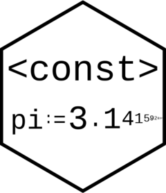

<!-- README.md is generated from README.Rmd. Please edit that file -->

```{r, include = FALSE}
knitr::opts_chunk$set(
  collapse = TRUE,
  comment = "#>",
  fig.path = "man/figures/README-",
  out.width = "100%"
)
```

# const <a href='michaelbarrowman.co.uk/const'></a>


<!-- badges: start -->
[](https://github.com/MyKo101/const/actions)
[](https://codecov.io/gh/MyKo101/const?branch=master)
<!-- badges: end -->

The goal of const is to allow users to create constants, rather than 
variables. Once a constant has been defined, its value cannot be changed.

```{r color, echo = FALSE, results='asis'}
# crayon needs to be explicitly activated in Rmd
options(crayon.enabled = TRUE)
# Hooks needs to be set to deal with outputs
# thanks to fansi logic
old_hooks <- fansi::set_knit_hooks(knitr::knit_hooks, 
                                   which = c("output", "message", "error"))
```

## Installation

You can install the released version of const from [CRAN](https://CRAN.R-project.org) with:

``` r
install.packages("const")
```

And the development version from [GitHub](https://github.com/) with:

``` r
# install.packages("devtools")
devtools::install_github("MyKo101/const")
```
## Example

To create a constant within R, you can use the `:=` assignment operator

```{r example}
library(const)

x := "hello world"
x
```

Here, `x`, is now a constant and cannot be changed
```{r change, error=TRUE}
x := 2
```

To delete a constant, use `rm()`

```{r delete}
rm(x)
```

