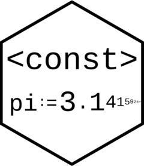

<!-- README.md is generated from README.Rmd. Please edit that file -->

# const <a href='https://www.michaelbarrowman.co.uk/const/'></a>

<!-- badges: start -->

[](https://github.com/MyKo101/const/actions)
[](https://codecov.io/gh/MyKo101/const?branch=master)
<!-- badges: end -->

The goal of const is to allow users to create constants, rather than
variables. Once a constant has been defined, its value cannot be
changed.

<STYLE type='text/css' scoped>
PRE.fansi SPAN {padding-top: .25em; padding-bottom: .25em};
</STYLE>

## Installation

You can install the released version of const from
[CRAN](https://CRAN.R-project.org) with:

``` r
install.packages("const")
```

And the development version from [GitHub](https://github.com/) with:

``` r
# install.packages("devtools")
devtools::install_github("MyKo101/const")
```

## Example

To create a constant within R, you can use the `:=` assignment operator

``` r
library(const)
#> Warning: package 'const' was built under R version 4.1.0

x := "hello world"
x
```

<PRE class="fansi fansi-output"><CODE>#&gt; <span style='color: #BBBB00;'>&lt;const&gt;
#&gt; </span><span>[1] "hello world"
</span></CODE></PRE>

Here, `x`, is now a constant and cannot be changed

``` r
x := 2
#> Error: x := 2
#> Cannot re-assign constant.
```

To delete a constant, use `rm()`

``` r
rm(x)
```
